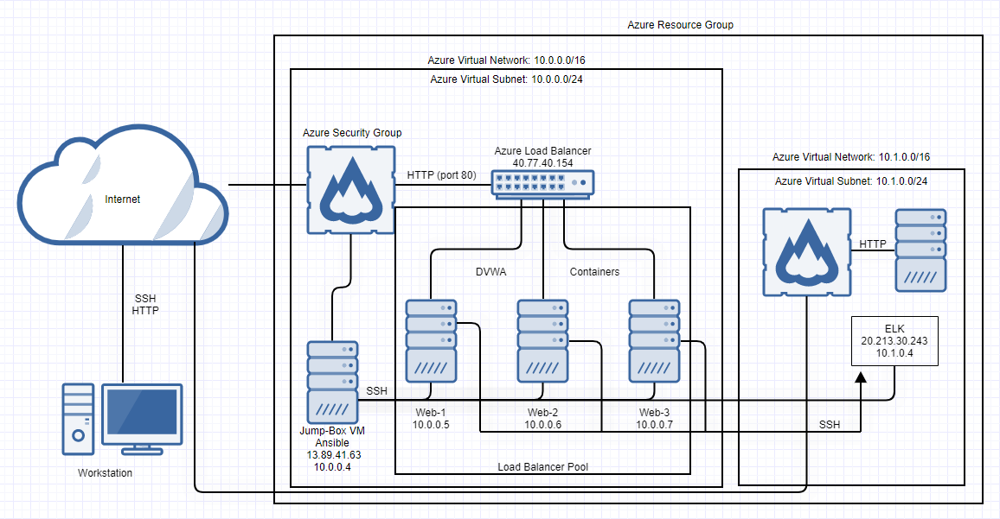

## Automated ELK Stack Deployment

The files in this repository were used to configure the network depicted below.

These files have been tested and used to generate a live ELK deployment on Azure. They can be used to either recreate the entire deployment pictured above. 

  - install-elk.yml

This document contains the following details:
- Description of the Topologu
- Access Policies
- ELK Configuration
  - Beats in Use
  - Machines Being Monitored
- How to Use the Ansible Build

### Description of the Topology

The main purpose of this network is to expose a load-balanced and monitored instance of DVWA, the Damn Vulnerable Web Application.

Load balancing ensures that the application will be highly stable, in addition to securing access to the network.
- A load balancer protects the availability of an application.
- A jump box seperates the control over an application and the application itself.

Integrating an ELK server allows users to easily monitor the vulnerable VMs for changes to the data and system logs.
- Filebeat watches log files and events for elasticsearch
- Metricbeat records metrics and statistics

The configuration details of each machine may be found below.

| Name     | Function | IP Address | Operating System |
|----------|----------|------------|------------------|
| Jump Box | Gateway  | 10.0.0.4   | Linux            |
| Web-1    | Server   | 10.0.0.5   | Linux            |
| Web-2    | Server   | 10.0.0.6   | Linux            |
| Web-3    | Server   | 10.0.0.7   | Linux            |
| ElkVM    | Server   | 10.1.0.4   | Linux            |

### Access Policies

The machines on the internal network are not exposed to the public Internet. 

Only the jump box machine can accept connections from the Internet. Access to this machine is only allowed from the following IP addresses:
- 99.47.53.71

Machines within the network can only be accessed by ssh from jump box.
- The ELK VM is accessed only through my jump box. IP: 10.0.0.4

A summary of the access policies in place can be found in the table below.

| Name     | Publicly Accessable | Allowed IPs |
|----------|---------------------|-------------|
| Jump Box |         Yes         | 99.47.53.71 |
| Web-1    |          No         | 10.0.0.4    |
| Web-2    |          No         | 10.0.0.4    |
| Web-3    |          No         | 10.0.0.4    |
| ElkVM    |         Yes         | 99.47.53.71 |

### Elk Configuration

Ansible was used to automate configuration of the ELK machine. No configuration was performed manually, which is advantageous because...
- It can be used to deploy multiple exact copies of the same setup quickly.

The playbook implements the following tasks:
- Config Web VM with Docker
- Install pip3
- Install Docker python module
- Download and launch a docker web container
- Enable docker service

The following screenshot displays the result of running `docker ps` after successfully configuring the ELK instance.

!(diagrams/Network Diagram.drawio.png)

### Target Machines & Beats
This ELK server is configured to monitor the following machines:
- 10.0.0.5
- 10.0.0.6
- 10.0.0.7

We have installed the following Beats on these machines:
- Metricbeat
- Filebeat

These Beats allow us to collect the following information from each machine:
-Metricbeat reports system and service statistics about the Web VMs to the ELK stack VM.
-Filebeat parses and forwards system logs from the Web VMs to the ELK Stack in an easy to read format.

### Using the Playbook
In order to use the playbook, you will need to have an Ansible control node already configured. Assuming you have such a control node provisioned: 

SSH into the control node and follow the steps below:
- Copy the install-elk.yml file to /etc/ansible.
- Update the hosts file to include the IP addresses on your virtual machines.
- Run the playbook, and navigate to http://[yourloadbalancerip]:5601/app/kibana to check that the installation worked as expected.
